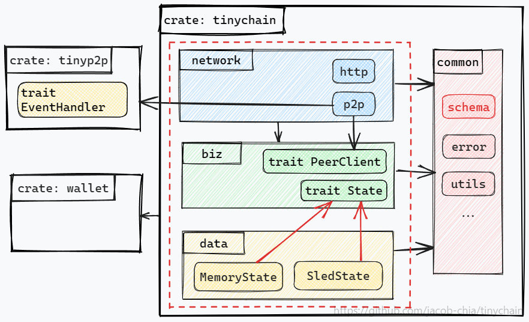

# 跟我一起写区块链

[English](README.md) | [简体中文](README_ZH.md)

## 目录

- [00 | 概览](README_ZH.md)
- [01 | 架构设计](doc/zh/01-architecture.md)
- [02 | 项目初始化：Pre-commit Hooks 与 Github Action](doc/zh/02-init-project.md)
- [03 | 定义数据结构与接口](doc/zh/03-data-structure-api.md)
- [04 | 钱包: 签名与验签](doc/zh/04-wallet.md)
- [05 | 读取命令行与配置文件](doc/zh/05-cmd-config.md)
- [06 | libp2p: 需求分析与封装思路](doc/zh/06-libp2p.md)
- [07 | tinyp2p：基于 CSP 的无锁并发模型](doc/zh/07-tinyp2p.md)
- [08 | 网络层](doc/zh/08-network.md)
- [09 | 业务层：在业务层如何做读写分离？](doc/zh/09-biz.md)
- [10 | 存储层、功能演示](doc/zh/10-data.md)

## 项目简介

本项目旨在通过一个`分布式账本`来演示区块链的基本原理，主要功能包括：

- 通过 `HTTP JSON API` 向用户提供`转账`、`查询`等功能；
- 节点之间通过 `P2P` 协议进行交互，数据通过 `protobuf` 编解码，功能包括`节点发现`、`广播交易`、`广播区块`、从最佳节点（区块高度最高的节点）`同步区块`等；
- 共识机制采用 `POW`；
- 使用 `sled`（纯 Rust 编写的嵌入式 KV store， 对标 RocksDB）存储状态；
- 为了方便演示，节点提供了`钱包`的`签名/验签`功能，用户发送交易时无需对交易签名，签名的动作由节点自动完成。

## 架构

> 详见原文[01 | 架构设计](doc/zh/01-architecture.md)

从整体看，本项目是一个 workspace，由三个 crates 组成：`tinychain`、`tinyp2p`、和 `wallet`。

- `tinychain`: 核心业务。
- `tinyp2p`: 将功能繁多但很难用的 rust-libp2p 封装成功能满足本项目需求但“开箱即用”的 tinyp2p。
- `wallet`: 生成账户私钥、签名、验签。

### tinychain | 依赖倒置

> 详见原文[01 | 架构设计](doc/zh/01-architecture.md)

在`tinychain`中，按职责划分为三层：

- `网络层（network）`：负责与外界交互，包括处理 HTTP 请求和与其他 Peer 交互
- ⭐`业务层（biz）`：基于**依赖倒置**的原则，需要使用 network 和 data 提供的功能，但不依赖它们，而是让它们依赖自己。
  - `trait PeerClient`: biz 需要通过 p2p 向其他节点发送数据。但 biz 不依赖网络层，而是通过`trait PeerClient`定义 p2p 的行为，然后由 p2p 实现该 trait。
  - `trait State`: biz 需要通过存储层保存本地状态，但不依赖存储层，而是通过`trait State`定义存储层的行为，由存储层实现该 trait。
- `存储层（data）`：实现 biz 定义的 trait State。

### tinychain::biz | 在业务层读写分离

> 详见原文[09 | 业务层：在业务层如何做读写分离？](doc/zh/09-biz.md)

biz 层通过读写分离做到了无锁编程。也就是说，`任何线程都可以“读”，但只有一个线程能“写”`。在本项目中，主要的写操作有两个：（1）将用户转账数据添加至交易池；（2）将区块添加至数据库。从上图来看，只有 Miner 线程有写权限，其他线程需要写操作时，将数据通过 channel 发送给 Miner 来写。

### tinyp2p | CSP 并发模型

> 详见原文[07 | tinyp2p：基于 CSP 的无锁并发模型](doc/zh/07-tinyp2p.md)

- `p2p_client` 用来处理用户请求，在 `p2p_client` 内部将请求转为 `cmd` 发送到 channel 中；
- 一个后台进程独占 `mut p2p_server`，逐个从 channel 中获取 cmd 执行；
- 在 p2p_server 中，有用户注册的`event_handler`，当收到来自远端的数据时，调用`event_handler`来处理；

### 功能演示

> 详细的演示脚本详见[10 | 存储层、功能演示](doc/zh/10-data.md)

1. 查看有哪些命令：`RUST_LOG=info ./target/debug/tinychain`：

   

2. 创建账户：`RUST_LOG=info ./target/debug/tinychain new-account`：

   

3. 查询账户余额和区块信息

   
