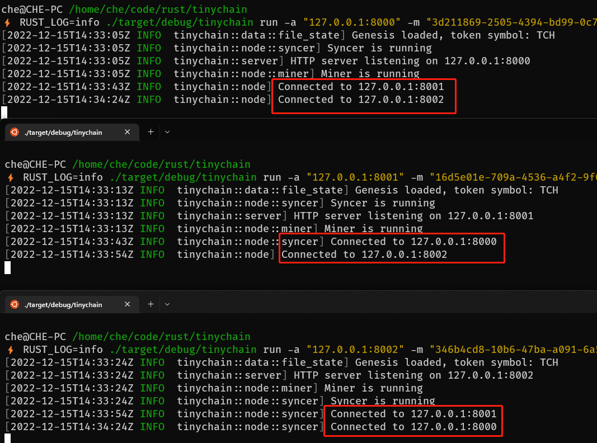
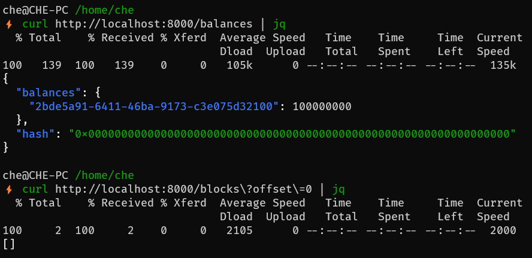
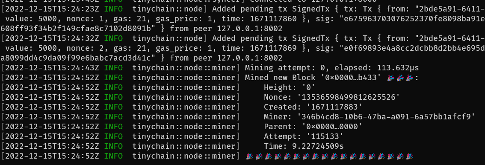
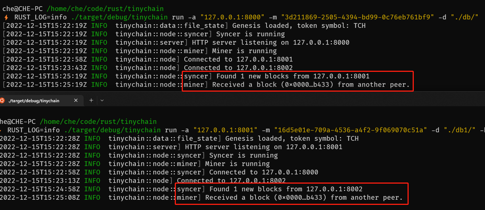
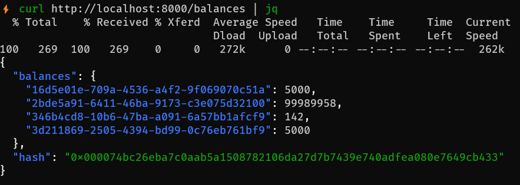
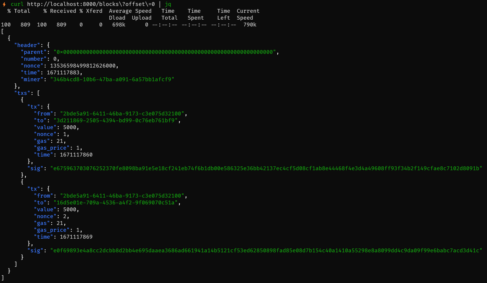

## 1 异步

相关依赖
 - [tokio](https://docs.rs/crate/tokio/latest): 异步运行时
 - [axum](https://docs.rs/crate/axum/latest): HTTP Server

### 1.1 最少必要知识

- 知道 `#[tokio::main]` 和 `async/await` 就可以写异步代码。

初学者可以暂时跳过所有讲异步底层原理的内容，知道 `何时用` 和 `怎么用` 即可。
 - 何时用：最典型的场景是`并发处理网络I/O` (拓展阅读：什么时候不适合异步？`https://tokio.rs/tokio/tutorial#when-not-to-use-tokio`)
 - 如何用：Tokio教程建议反复阅读（`https://tokio.rs/tokio/tutorial`）

### 1.2 如何只让HTTP Server用异步运行时？

```rs
// main.rs
fn main() {
    // ...

    let node = new_arc_node(addr, miner, bootstrap_addr); // Arc<Node> 并发安全的只读引用
    let miner = node.clone();
    let syncer = node.clone();

    let (block_sender, block_receiver) = bounded(1000);
    thread::spawn(move || syncer.sync(block_sender));  // Syncer 线程
    thread::spawn(move || miner.mine(block_receiver)); // Miner 线程
    server::run(node);                                 // 内部创建了一个异步多线程运行时
}

// server/mod.rs
pub fn run<S, P>(node: Arc<Node<S, P>>)
where
    S: State + Send + Sync + 'static,
    P: Peer + Send + Sync + 'static,
{
    // ...

    let runtime = tokio::runtime::Builder::new_multi_thread()
        .enable_all()
        .build()
        .unwrap();

    runtime.block_on(async {
        let app = router::new_router(node);

        Server::bind(&addr)
            .serve(app.into_make_service())
            .await
            .unwrap();
    });
}
```

## 2 错误处理

相关依赖
 - [thiserror](https://docs.rs/crate/thiserror/latest)

### 错误类型转换

```rs
// error.rs
#[derive(Error, Debug)]
pub enum ChainError {
    // 1. thiserror 可以自动为 AddrParseError 实现 From trait
    #[error("Invalid peer address")]
    InvalidPeerAddress(#[from] AddrParseError),

    // ...
}

// wallet/mod.rs
fn get_wallet(account: &str) -> Result<LocalWallet, ChainError> {
    let mut keypath = get_keystore_dir().to_owned();
    keypath.push_str(account);

    // 2. 若From trait 无法满足需求，可通过 map_err 自己转换
    LocalWallet::decrypt_keystore(&keypath, PASSWORD)
        .map_err(|_| ChainError::AccountNotFound(account.to_string()))
}
```

### 不同的错误返回不同的HTTP Status

```rs
// error.rs

// Tell axum how to convert `ChainError` into a response.
impl IntoResponse for ChainError {
    fn into_response(self) -> Response {
        let (status, msg) = match self {
            ChainError::InvalidPeerAddress(_) => (StatusCode::BAD_REQUEST, self.to_string()),
            ChainError::InsufficientBalance(_, _) => (StatusCode::FORBIDDEN, self.to_string()),
            // ...
        };

        let body = Json(json!({ "error": msg }));
        (status, body).into_response()
    }
}
```

## 3 Node

相关依赖
 - [dashmap](https://docs.rs/crate/dashmap/latest): 并发安全的HashMap
 - [crossbeam-channel](https://docs.rs/crate/crossbeam-channel/latest): 比 std 更好用的 channel

### 关键代码导读

- 定时从其他节点同步数据：`node/syncer.rs`
- 定时生成区块：`node/miner.rs`

### Rust 可以安全地使用锁吗？

- 不会`忘记加锁`：Rust中`Mutex<T>`将`T`封装为新类型，不能越过Mutex直接使用T；
- 不会`忘记释放锁`：Rust的所有权系统使得 Mutex<T> 在`离开作用域时`自动释放锁；
  - 如何尽早释放锁：在用完锁之后，尽快让该变量离开作用域，别等函数执行完（详见下方例子）
- 可能出现`死锁`：比如一个操作需要锁住两个资源，而两个线程分别持有其中一个锁；

### 尽早释放锁

```rs
fn some_fn() {
    let message = {
        // 获取锁
        let consumer = shared_data
            .consumer
            .lock()
            .expect("Unable to lock the consumer!");
        // 使用资源
        consumer.recv()
    }; // concumer 离开作用域，自动释放

    // 这里还有很耗时的代码要执行
}
```

### 一个死锁的案例

`node/syncer.rs`:

```rs
// 遍历 self.peers时，会给 peers 加上读锁，直到遍历结束
for (peer_addr, connected) in self.peers {
    // 在 for 内部，会修改 self.peers（添加新发现的 peer，删除出问题的 peer）
    // 在修改 peers 时会尝试加写锁，然后出现死锁
    if let Err(err) = self.sync_from_peer(&peer_addr, connected, block_sender.clone()) {
        self.remove_peer(&peer_addr);
    }
}
```

如果不用 `dashmap`，自己对 `HashMap` 加锁，可能会有什么坑？

```rs
// self.peers 的类型为 Arc<RwLock<HashMap<String, Connected>>>

// self.peers.write().unwrap() 的意思是获取 self.peers 的写锁
for (peer_addr, connected) in self.peers.write().unwrap() {
    // 在 for 循环内部就不需要加锁了，直接修改 self.peers
    if let Err(err) = self.sync_from_peer(&peer_addr, connected, block_sender.clone()) {
        self.remove_peer(&peer_addr);
    }
}
```

上述代码不会出现死锁，但这么做有什么问题？
  - `写`锁是独占锁，在执行 for 循环的过程中一直持有该锁，导致其他线程在此期间无法读取 self.peers 的数据
  - 所以，即使不用 dashmap，也要先 clone 一份，尽早把`读锁`释放掉，然后再需要写操作的时候再加`写锁`。

## 4 HTTP Peer

相关依赖
 - [reqwest](https://docs.rs/crate/reqwest/latest): HTTP Client

### Deref/DerefMut

```rs
// HttpPeer 只是 reqwest::blocking::Client 的 wrapper
#[derive(Debug)]
pub struct HttpPeer(Client);

/// Deref/DerefMut 可以让 HttpPeer 直接使用 Client 的方法
/// 比如 self.get(url)
impl Deref for HttpPeer {
    type Target = Client;

    fn deref(&self) -> &Self::Target {
        &self.0
    }
}

impl DerefMut for HttpPeer {
    fn deref_mut(&mut self) -> &mut Self::Target {
        &mut self.0
    }
}
```

若没有 `Deref/DerefMut`，HttpPeer 不得不把所有 reqwest 的接口实现一遍，内部做一个转发。


## 5 演示

### 演示账户

- `Treasury`: "2bde5a91-6411-46ba-9173-c3e075d32100"
- `Alice`: "3d211869-2505-4394-bd99-0c76eb761bf9"
- `Bob`: "16d5e01e-709a-4536-a4f2-9f069070c51a"
- `Emma`: "346b4cd8-10b6-47ba-a091-6a57bb1afcf9"

### 数据准备

将项目根目录下的`./db/`目录拷贝两份，分别为`./db1/`，`./db2/`

### 演示脚本

1. 启动三个节点

```sh
# -a 节点 HTTP Server 监听地址
# -m 节点的矿工账户（领取挖矿收益）
# -b bootstrap 地址，即在Peers网络中正在运行的任意节点地址

# Alice，第一个节点不需要指定 -b
RUST_LOG=info ./target/debug/tinychain run -a "127.0.0.1:8000" -m "3d211869-2505-4394-bd99-0c76eb761bf9" -d "./db/"
# Bob
RUST_LOG=info ./target/debug/tinychain run -a "127.0.0.1:8001" -m "16d5e01e-709a-4536-a4f2-9f069070c51a" -d "./db1/" -b "127.0.0.1:8000"
# Emma
RUST_LOG=info ./target/debug/tinychain run -a "127.0.0.1:8002" -m "346b4cd8-10b6-47ba-a091-6a57bb1afcf9" -d "./db2/" -b "127.0.0.1:8001"
```



2. 查询当前区块链状态

```sh
# 所有人的账户余额
curl http://localhost:8000/balances | jq
# 区块信息
curl http://localhost:8000/blocks?offset=0 | jq
```



3. 发送几笔交易

```sh
# 查询Treasury的下一个nonce，每笔Tx的nonce要加一
curl -X GET http://localhost:8002/account/nonce?account=2bde5a91-6411-46ba-9173-c3e075d32100

# Treasury -> Alice: 5000 | Miner: Emma (端口8002)
curl -X POST http://localhost:8002/transfer \
  -H 'Content-Type: application/json' \
  -d '{"from": "2bde5a91-6411-46ba-9173-c3e075d32100", "to": "3d211869-2505-4394-bd99-0c76eb761bf9", "value": 5000, "nonce": 1}'

# Treasury -> Bob: 5000 | Miner: Emma (端口8002)
curl -X POST http://localhost:8002/transfer \
  -H 'Content-Type: application/json' \
  -d '{"from": "2bde5a91-6411-46ba-9173-c3e075d32100", "to": "16d5e01e-709a-4536-a4f2-9f069070c51a", "value": 5000, "nonce": 2}'
```

4. Emma 节点生成了1个区块



5. 另外两个节点显式同步了1个区块



6. 查询所有人的余额
 - curl http://localhost:8000/balances | jq



7. 查询区块信息
 - curl http://localhost:8000/blocks?offset=0 | jq


