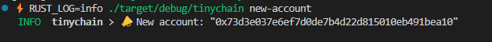
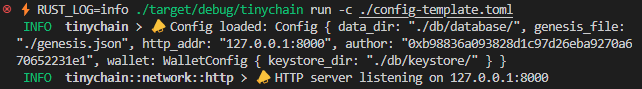

- [05 | 读取命令行与配置文件](#05--读取命令行与配置文件)
  - [1 定义命令行参数](#1-定义命令行参数)
  - [2 解析并执行命令](#2-解析并执行命令)
  - [3 演示](#3-演示)
  - [4 小结](#4-小结)

# 05 | 读取命令行与配置文件

> 本文为实战课，需要切换到对应的代码分支，并配合依赖库的文档一起学习。
>
> - Repo: `https://github.com/jacob-chia/tinychain.git`
> - 分支：`git fetch && git switch 05-cmd-config`
> - [clap](https://docs.rs/clap/latest/clap/): 解析命令行
> - [toml](https://docs.rs/toml/latest/toml/): 解析配置文件

这节课，我们要添加两个命令:

- `new-account`: 创建一个账户，返回账户地址。可通过参数指定账户存储路径
- `run`: 运行 tinychain 节点服务。运行参数通过配置文件传入

## 1 定义命令行参数

按照[clap](https://docs.rs/clap/latest/clap/)的要求写样板代码即可，直接看代码。

```rs
// src/main.rs

/// The command of tinychain
#[derive(Debug, Parser)]
struct Opts {
    #[command(subcommand)]
    subcmd: SubCommand,
}

#[derive(Debug, Subcommand)]
enum SubCommand {
    /// Create a new account for signing transactions
    NewAccount {
        /// the keystore directory, default is `./db/keystore/`
        #[arg(short, long, default_value_t = String::from("./db/keystore/"))]
        keystore_dir: String,
    },
    /// Run the node
    Run {
        /// the config file path, default is `config.toml`
        #[arg(short, long, default_value_t = String::from("config.toml"))]
        config: String,
    },
}
```

## 2 解析并执行命令

```rs
// src/main.rs

#[tokio::main]
async fn main() {
    pretty_env_logger::init();
    // 解析命令
    let opts = Opts::parse();
    // 执行命令
    match opts.subcmd {
        SubCommand::NewAccount { keystore_dir } => new_account(&keystore_dir),
        SubCommand::Run { config } => run(&config).await,
    }
}

fn new_account(keystore_dir: &str) {
    let wallet = Wallet::new(keystore_dir);
    let acc = wallet.new_account().unwrap();
    info!("📣 New account: {:?}", acc);
}

async fn run(config_file: &str) {
    let cfg = Config::load(config_file).unwrap();
    info!("📣 Config loaded: {:?}", cfg);

    // ...
}
```

其中，当执行`run()`时指定了配置文件，配置模板就不贴了，上链接：[./config-template.toml](../config-template.toml)。我们直接看 Rust 代码：

```rs
// src/config.rs

#[derive(Clone, Debug, Default, Deserialize)]
pub struct Config {
    /// The path to the data directory.
    pub data_dir: String,
    /// The path to the genesis file.
    pub genesis_file: String,
    /// The address to listen on for HTTP Server.
    pub http_addr: String,
    /// The miner account to receive mining rewards.
    pub author: String,
    /// Wallet configuration.
    pub wallet: WalletConfig,
}

impl Config {
    /// Load the configuration from the given path.
    pub fn load(path: &str) -> Result<Self, Error> {
        let content =
            fs::read_to_string(path).map_err(|_| Error::ConfigNotExist(path.to_string()))?;

        let config: Config = toml::from_str(&content)?;
        Ok(config)
    }
}
```

## 3 演示

> 注意：代码中的日志级别是`info`，所以我们运行时要加上`RUST_LOG=info`参数

1. 编译：`cargo build`;
2. 查看有哪些命令：`RUST_LOG=info ./target/debug/tinychain`：

   

3. 创建账户：`RUST_LOG=info ./target/debug/tinychain new-account`：

   

4. 运行服务：`RUST_LOG=info ./target/debug/tinychain run -c ./config-template.toml`：

   

## 4 小结

本课没有难点，主要演示了两个功能：

- 解析命令行参数
- 读取配置文件

---

| [< 04-钱包: 签名与验签](./04-wallet.md) | [06-libp2p: 需求分析与封装思路 >](./06-libp2p.md) |
| --------------------------------------- | ------------------------------------------------- |
