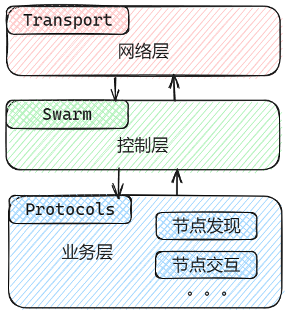
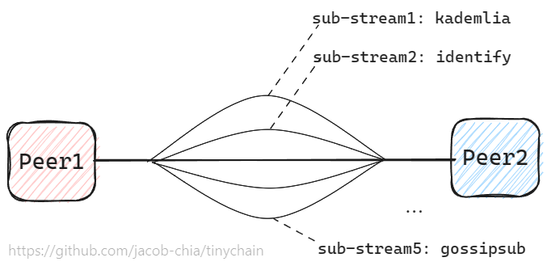

- [06 | libp2p: 需求分析与封装思路](#06--libp2p-需求分析与封装思路)
  - [1 libp2p 架构](#1-libp2p-架构)
    - [1.1 分层](#11-分层)
    - [1.2 三层如何协同工作](#12-三层如何协同工作)
  - [2 两种封装风格分析](#2-两种封装风格分析)
    - [2.1 把业务逻辑放到自定义 Protocol 中](#21-把业务逻辑放到自定义-protocol-中)
      - [版本一：使用 behaviour(ignore) 宏](#版本一使用-behaviourignore-宏)
      - [版本二：引用官方 ConnectionHandler，自己实现 NetworkBehaviour](#版本二引用官方-connectionhandler自己实现-networkbehaviour)
    - [2.2 把业务逻辑放到 SwarmEventHandler 中](#22-把业务逻辑放到-swarmeventhandler-中)
  - [3 需求分析](#3-需求分析)
    - [3.1 节点发现](#31-节点发现)
      - [(1) Kademlia Bootstrap](#1-kademlia-bootstrap)
      - [(2) 需要与 Identify 配合使用](#2-需要与-identify-配合使用)
      - [(3) 需要与 Ping 配合使用](#3-需要与-ping-配合使用)
      - [(4) 需要切换到 Server 模式](#4-需要切换到-server-模式)
      - [(5) 总结](#5-总结)
    - [3.2 请求响应](#32-请求响应)
    - [3.3 广播消息](#33-广播消息)
  - [4 小结](#4-小结)

# 06 | libp2p: 需求分析与封装思路

> 本文为实战课，需要切换到对应的代码分支，并配合依赖库的文档一起学习。
>
> - 代码分支：`git fetch && git switch 06-libp2p`
> - [libp2p 官网](https://docs.libp2p.io/concepts/introduction/overview/)：非常重要，会解释非常多的新概念，是学习 libp2p 的第一课。
> - [libp2p spec](https://github.com/libp2p/specs)：这个是比官网更详细的开发指导手册，所有语言的实现都基于这个 specs。
> - [rust-libp2p](https://docs.rs/libp2p/latest/libp2p/index.html): libp2p 的 Rust 实现。

从本课开始，就到了项目的重头戏了。学习 libp2p 任重而道远，但成为 libp2p 高手之前，我觉得更重要的是先把它用起来。本课程不会涉及过多底层原理，而是从实战角度使用 libp2p。

这节课不写代码，在写代码之间，我们要弄清楚几个问题：

1. libp2p 怎么用？
2. 如何封装 libp2p？
3. 我们要基于 libp2p 的哪些模块封装？
4. 如何封装这些模块？

## 1 libp2p 架构

### 1.1 分层



[libp2p 官方文档](https://docs.libp2p.io/concepts/introduction/overview/)一定要看，下文出现的新概念在这个文档里基本上都有。但如果简单概括的话，可以把 libp2p 分为三层：

- `Transport` 传输层：负责数据的传输。`// 相当于 tinychain 的网络层`
- `Protocols` 协议层：负责数据的处理。`// 相当于 tinychain 的业务层，libp2p 没有状态，所以不需要数据层`
- `Swarm` 控制层：负责将 `Transport` 和 `Protocols` 结合起来，相当于 HTTP Server 中的 Controller。 `// tinychain 业务较简单，省略了 Controller`

1. Transport

libp2p 的 transport 支持丰富的配置，包括：

- 底层网络协议：支持 `TCP` / UDP / QUIC 等；
- 安全协议：支持 TLS 1.3 / `Noise`;
- 多路复用（Stream Multiplexing）：支持 `Yamux`，mplex 从 libp2p-0.52.0 开始不再支持。

下节课我们要写的 tinyp2p 使用的配置是`TCP` + `Noise` + `Yamux`。

- 对于 Noise，我们只需要知道它与 TLS 最大的区别是**不需要 CA 证书**。
- 对于 Yamux，它可以**将一个 TCP 链接模拟成多条链路**。比如一个 P2P 节点要使用很多 Protocols，包括节点发现（Kademlia、Identify、Ping）、内容发现（Gossipsub）、和请求响应（Request-Response），那么 Yamux 就可以像下图一样，在一条 TCP 链接上模拟出多条链路，每条链路处理一个 Protocol。



2. Protocols

libp2p 定义了很多官方协议 [spec](https://github.com/libp2p/specs#protocols)，我们也可以实现自己的协议，这是封装 libp2p 的方式之一。

一个 Protocol 包含两个核心部分：`Behaviour` 和 `BehaviourEvent`。在构造 Swarm 时需要 Behaviour；在处理 SwarmEvent 时需要处理 BehaviourEvent。

### 1.2 三层如何协同工作

我们通过一段伪代码来演示这三层是如何协同工作的：

```rs
// 创建公私钥对，用于传输层加密
let local_key = config.gen_keypair()?;
let local_peer_id = local_key.public().to_peer_id();

// 创建Transport
let transport = transport::build_transport(local_key.clone());
// 【注 1】自定义Protocol，内部由多个官方protocols或自定义protocols组合而成
let behaviour = custom_protocol::Behaviour::new(local_key)?;
// 创建Swarm，注意入参有 transport 和 behaviour
SwarmBuilder::with_tokio_executor(transport, behaviour, local_peer_id).build()

// 监听一个地址
swarm.listen_on(addr)?;

// 【注 2】处理SwarmEvent
while let event = swarm.select_next_some() {
    // 除了Swarm自身Event之外，还有BahaviourEvent
}
```

上述代码不仅演示了一个 P2P 节点的构造过程，从中还可以看出有两个地方可以添加自己的逻辑：

- 【注 1】：`自定义Protocol`：可根据项目需求实现自己的功能；
- 【注 2】：`处理SwarmEvent`： 可对自己关心的事件添加一些自定义逻辑；

以上两个地方肯定要自己封装，但把主要逻辑放到 Protocol 中还是 Swarm 事件处理函数中，这是一个问题。我理解的 Protocol 相当于业务层，Swarm 相当于控制层，那业务逻辑肯定是放到业务层啊，不是这样吗？我遇到了什么问题？

## 2 两种封装风格分析

> tldr: 将几个官方 protocols 组合到一起非常简单，但自定义一个 protocol 的难度在不断升高。所以我推荐一些简单的业务逻辑可以放到 SwarmEvent Handler 中。

### 2.1 把业务逻辑放到自定义 Protocol 中

我一开始觉得这么做是毫无疑问的，开始尝试。

#### 版本一：使用 behaviour(ignore) 宏

```rs
// 这一行可以自动为这个 struct 实现 NetworkBehaviour trait，并在该模块内生成对应的 `BehaviourEvent`
// 简单来说，这个宏可以让这个模块变成一个Protocol
#[derive(NetworkBehaviour)]
pub struct Behaviour {
    // 官方的 behaviour，负责与其他节点交互
    req_resp: request_response::Behaviour<GenericCodec>,
    // ... 其他 behaviours

    // 添加字段记录状态，并标记这不是一个sub-behaviour
    // 这个字段需要和req_resp配合使用，先不用关心什么意思，只需关注代码风格
    #[behaviour(ignore)]
    pending_outbound_requests: HashMap<RequestId, oneshot::Sender<ResponseType>>,
}

// 其他逻辑 ...
```

经验证确认，libp2p 在 2022-08-29 开始不支持这种方法了，相关 [issue 2842](https://github.com/libp2p/rust-libp2p/pull/2842)

#### 版本二：引用官方 ConnectionHandler，自己实现 NetworkBehaviour

> 直到 2023-06-20（libp2p-v0.52.0 发布之前），以下代码还 OK。

通过版本一，我们知道了 `#[derive(NetworkBehaviour)]` 可以让一个结构体变成一个 Protocol，但该结构体中的所有字段都必须是一个 sub-behaviour，不能包含其他字段。
所以我们需要自定义一个 `req_resp` Protocol。

通过查看官方的 request_response 源码，可以知道自定义一个 protocol 要做以下几件事：

- 定义`Event`；
- 定义`struct Behaviour`；
- 为`Behaviour`实现`trait NetworkBehaviour`;
- 【可选】定义`struct Handler`;
- 【可选】为`Handler`实现`trait ConnectionHandler`

伪代码如下：

```rs
// protocol.rs

// 这一层只是 sub-behaviours的组合，不添加其他字段
#[derive(NetworkBehaviour)]
pub struct Behaviour {
    // 自定义的 behaviour
    req_resp: req_resp::Behaviour,
    // ... 其他 behaviours
}
```

```rs
// req_resp.rs

pub enum Event { /* ... */};

pub struct Behaviour {
    // 官方的 behaviour，要实现的大部分接口都转发到inner中
    inner: request_response::Behaviour<GenericCodec>,

    // 添加字段记录状态，先不用关心这行是做什么的，只看封装思路
    pending_outbound_requests: HashMap<RequestId, oneshot::Sender<ResponseType>>,
}

impl NetworkBehaviour for Behaviour {
    // 这里直接使用官方的request_response::Handler
    type ConnectionHandler = request_response::Handler;
    // 自定义的Event
    type OutEvent = Event;

    // 需要实现一些接口，在这里添加自己的业务逻辑。
}
```

上面代码的关键是 `type ConnectionHandler = request_response::Handler;` 这样就省去了很大工作量，我们只需要自己实现 NetworkBehaviour 就行了。

我本来是按这种方式封装的 tinyp2p，直到我将版本更新到 libp2p-v0.52.0（2023-06-20 发布），我发现官方 Handlers 都成私有的了，如果要自定义 Protocol 必须自己实现 ConnectionHandler，而我们要自定义 Kademlia 和 request-response 两个 protocols，感兴趣的同学可以看看官方这两个 protocols 中 Handler 的代码量。而且，我明明只需要少量的自定义功能，却不得不写大量的代码来实现它，我觉得这不是条正确的路。

> libp2p 让 handlers 变成私有的动机可能是这样的（相关[issue](https://github.com/libp2p/rust-libp2p/issues/3608)）
>
> To have the ability to refactor implementation details without causing breaking changes.

### 2.2 把业务逻辑放到 SwarmEventHandler 中

这个方式就要简单很多了，都不需要用代码辅助解释，流程如下：

1. 挑选自己需要的官方 protocols，组合到一个 struct 中；
2. 用`#[derive(NetworkBehaviour)]`修饰这个 struct;
3. 查看文档/源码，确认自己引用的 protocols 有哪些 events，挑选出需要处理的 events；
4. 在 Swarm 层 `while let event = swarm.select_next_some()`时添加处理函数；

所以，我们下节课就用这种方式封装自己的逻辑。

## 3 需求分析

### 3.1 节点发现

> tldr: 难用的跟\*一样

#### (1) Kademlia Bootstrap

Kademlia 是 p2p 网络中最重要的协议之一，功能很多，但本项目不需要掌握 Kademlia 底层原理，只需要知道一个概念，会用一个接口就行。

- 一个概念：[什么是 Kad-DHT？](https://docs.libp2p.io/concepts/discovery-routing/kaddht/)文档不长，建议您先看一下。
- 一个接口：[Bootstrap](https://docs.rs/libp2p/latest/libp2p/kad/struct.Kademlia.html#method.bootstrap)

简单来说，可以把 Kad-DHT 类比为“微信朋友圈”，整个网络中可能有大量的 Peers，但每个 Peer 并不需要知道其他所有 Peers，只需要知道与自己“社交距离”较近的那些 Peers 就行（根据 PeerID 可以计算两个 Peer 的“社交距离”），所有 Peer 的朋友圈的并集就是整个网络中的 Peers，而 Bootstrap 就是用来维护这个朋友圈的。

在 Bootstrap 过程中，Kademlia 会将新发现的节点加入 Kad-DHT，这个好理解（在下节课实战时会演示）；但当一个节点无法联通时，Kademlia 会怎么做？我们看一下 rust-libp2p 的源码实现：

```rs
// https://github.com/libp2p/rust-libp2p/blob/master/protocols/kad/src/behaviour.rs#L1765

fn address_failed(&mut self, peer_id: PeerId, address: &Multiaddr) {
    let key = kbucket::Key::from(peer_id);

    if let Some(addrs) = self.kbuckets.entry(&key).value() {
        // TODO: Ideally, the address should only be removed if the error can
        // be classified as "permanent" but since `err` is currently a borrowed
        // trait object without a `'static` bound, even downcasting for inspection
        // of the error is not possible (and also not truly desirable or ergonomic).
        // The error passed in should rather be a dedicated enum.
        if addrs.remove(address).is_ok() {
            debug!(
                "Address '{}' removed from peer '{}' due to error.",
                address, peer_id
            );
        } else {
            // Despite apparently having no reachable address (any longer),
            // the peer is kept in the routing table with the last address to avoid
            // (temporary) loss of network connectivity to "flush" the routing
            // table. Once in, a peer is only removed from the routing table
            // if it is the least recently connected peer, currently disconnected
            // and is unreachable in the context of another peer pending insertion
            // into the same bucket. This is handled transparently by the
            // `KBucketsTable` and takes effect through `KBucketsTable::take_applied_pending`
            // within `Kademlia::poll`.
            debug!(
                "Last remaining address '{}' of peer '{}' is unreachable.",
                address, peer_id,
            )
        }
    }
    // ... 其他代码略
}

// 上面 `addrs.remove(address).is_ok()` 对应的 remove接口
pub fn remove(&mut self, addr: &Multiaddr) -> Result<(), ()> {
    if self.addrs.len() == 1 {
        return Err(());
    }

    if let Some(pos) = self.addrs.iter().position(|a| a == addr) {
        self.addrs.remove(pos);
        if self.addrs.len() <= self.addrs.inline_size() {
            self.addrs.shrink_to_fit();
        }
    }

    Ok(())
}
```

从上述代码中我们可以看到，一个 Peer 可以绑定多个地址，当一个地址无法联通时，会尝试将其从该 Peer 中移出，但 Peer 中至少会保留一个地址，即使这个地址是无法访问的。也就是说，Bootstrap 不会移出无法联通的节点。但我们的项目出于演示目的，需要看到 DHT 的动态变化，所以我们需要在节点无法联通时手动移除该节点。

#### (2) 需要与 Identify 配合使用

> [Identify 官方文档](https://docs.libp2p.io/concepts/fundamentals/protocols/#identify)。
> 简单来说，Identify 是用来定期交换节点信息的，其中包含节点的地址信息。

我们看 rust-libp2p 的文档中，关于 Kademlia 的使用说明：

```md
// https://docs.rs/libp2p/latest/libp2p/kad/index.html#important-discrepancies

Peer Discovery with Identify In other libp2p implementations, the Identify protocol might be seen as a core protocol.
Rust-libp2p tries to stay as generic as possible, and does not make this assumption.
This means that the Identify protocol must be manually hooked up to Kademlia through calls to `Kademlia::add_address`.
If you choose not to use the Identify protocol, and do not provide an alternative peer discovery mechanism,
a Kademlia node will not discover nodes beyond the network’s boot nodes. Without the Identify protocol,
existing nodes in the kademlia network cannot obtain the listen addresses of nodes querying them, and thus will not be
able to add them to their routing table.
```

也就是说，Bootstrap 过程只会尝试发现新节点并与之建立链接，但不会将其加入 DHT。需要依赖 Identify 协议，在交换节点信息（包含地址）时显式调用`Kademlia::add_address`来将其加入 DHT。

#### (3) 需要与 Ping 配合使用

回顾一下我们在讲 Bootstrap 时说的，需要在节点**无法联通**时手动移除该节点。这个和 Ping 的目的不同。

- `无法联通`：指的是无法建立 connection
- `Ping 失败`：指的是已建立 connection，该 connection 并没有断开，但对方节点无响应。

这两个错误对应的 SwarmEvent 不同，都需要处理。

#### (4) 需要切换到 Server 模式

> [Server 模式官方文档](https://github.com/libp2p/specs/tree/master/kad-dht#client-and-server-mode)。
> 简单来说，只有 Server 模式的 Peer 会加入 DHT，Client 模式的 Peer 只能访问 DHT，而不能将自己加入。

这简直是个天坑！在更新版本后，我发现 Kademlia 不工作了，各种看日志查源码无果，于是，我想起了版本更新说明和 Changelog。

我们先看一下 libp2p-v0.52.0（2023-06-20 发布）的[更新说明](https://github.com/libp2p/rust-libp2p/releases/tag/libp2p-v0.52.0)：

```md
## Automatic kademlia client/server mode

Let's get the biggest one out the way first, I promise the other points are easier explained but equally exciting.
The tl;dr is: Healthier Kademlia routing tables and an improved developer experience.

If you don't know about Kademlia's client/server mode, checkout the specs.

With the v0.52 release, rust-libp2p automatically configures Kademlia in client or server mode depending on our
external addresses. If we have a confirmed, external address, we will operate in server-mode, otherwise client-mode.
This is entirely configuration-free (yay!) although follow-up work is under-way to allow setting this manually
in certain situations: #4074.
```

也就是说，在我的开发环境中没有公网 IP，所以 libp2p 自动以 Client 模式启动，并且，目前还不支持配置！（看到这儿差点回滚版本）。

然后我又看了下 Kademlia 的 Changelog，描述如下：

```md
// https://github.com/libp2p/rust-libp2p/blob/master/protocols/kad/CHANGELOG.md#0440

Automatically configure client/server mode based on external addresses. If we have or learn about an external
address of our node, e.g. through `Swarm::add_external_address` or automated through libp2p-autonat, we operate
in server-mode and thus allow inbound requests. By default, a node is in client-mode and only allows outbound requests.
If you want to maintain the status quo,
i.e. **always operate in server mode, make sure to add at least one external address through `Swarm::add_external_address`**.
See also Kademlia specification for an introduction to Kademlia client/server mode. See PR 3877.
```

还好可以通过`Swarm::add_external_address`来将 Peer 切换为 Server 模式。

#### (5) 总结

为了实现节点发现功能，我们需要做五件事：

- 构造 Peer 时要执行`Swarm::add_external_address`，切换为 Server 模式；
- 定期执行 Bootstrap;
- Identify 收到节点信息时将地址加入 DHT;
- 收到“建立连接失败”事件时手动移除该节点；
- 收到“Ping 失败”事件时手动移除该节点

### 3.2 请求响应

我们使用官方的 request-response 协议来与其他节点交互，只需要做一件事：

- 定义一个 `Codec`：用来定义如何收发一条完整的消息。我们的消息是 protobuf 编码的二进制流，所以需要指定二进制流的长度。

### 3.3 广播消息

这个可以用 gossipsub 协议，使用非常简单，只需要使用两个接口即可：

- `subscribe(topic)`: 订阅一个主题
- `publish(topic, msg)`: 向订阅该主题的节点发布消息

## 4 小结

这节课内容较多，但目的明确，我们找到了以下几个问题的答案：

1. libp2p 怎么用？

- libp2p 分为三层：`transport`, `swarm`, `protocol`
- 运行一个 P2P 节点的步骤：`构造 transport` -> `构造 protocol` -> `构造 swarm` -> `运行 swarm` -> `处理 swarm events`

2. 如何封装 libp2p？

- `自定义 protocol`：工作量很大，可能要重新实现官方已提供的 protocols
- `自定义 swarm event handlers`：较简单，找到要处理哪些 evnets，问题就解决了一半

3. 我们要基于 libp2p 的哪些模块封装？

- 节点发现：`kademlia`, `identify`, `ping`
- 请求响应：`request-response`
- 广播消息：`gossipsub`

4. 如何封装这些模块？

- 内容较多，详见上文。我们相当于列出了下节课要解决的 issues，为下节课的动手实践理清了思路。

另外，libp2p 还有一个局域网节点发现协议 mDNS，这个协议使用起来非常简单，几乎不需要配置，感兴趣的同学可以试试。

---

| [< 05-读取命令行与配置文件](./05-cmd-config.md) | [07-tinyp2p：封装复杂性 >](./07-tinyp2p.md) |
| ----------------------------------------------- | ------------------------------------------- |
