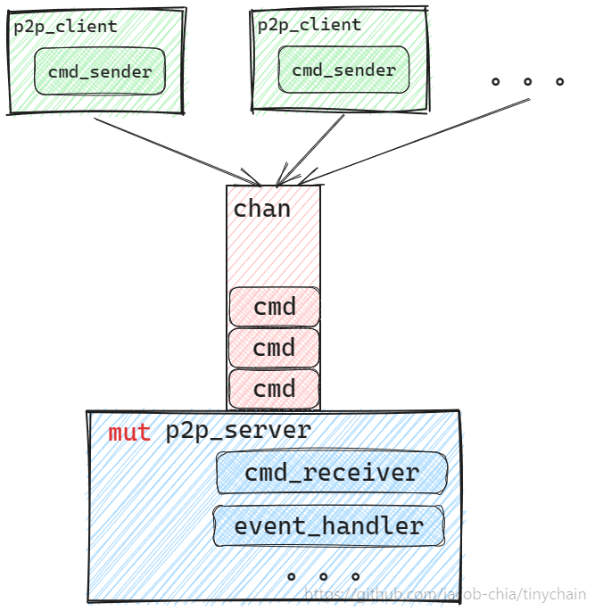

- [07 | Tinyp2p: A CSP Concurrency Model](#07--tinyp2p-a-csp-concurrency-model)
  - [1 CSP Concurrency Model](#1-csp-concurrency-model)
    - [1.1 Architecture](#11-architecture)
    - [1.2 How To Get The Response From The p2p_server?](#12-how-to-get-the-response-from-the-p2p_server)
    - [1.3 How to handle remote data asynchronously?](#13-how-to-handle-remote-data-asynchronously)
  - [2 Building The Framework](#2-building-the-framework)
    - [2.1 Building The Transport](#21-building-the-transport)
    - [2.2 Building The Protocol](#22-building-the-protocol)
    - [2.3 Building The P2P Server (Swarm)](#23-building-the-p2p-server-swarm)
    - [2.4 Building The P2P Client](#24-building-the-p2p-client)
    - [2.5 Defining The Interface For The User](#25-defining-the-interface-for-the-user)
  - [3 Putting Flesh On The Bones](#3-putting-flesh-on-the-bones)
    - [3.1 Peer Discovery](#31-peer-discovery)
    - [3.2 Sending Blocking Requests To Remote Peers](#32-sending-blocking-requests-to-remote-peers)
    - [3.3 Handling Requests From Remote Peers](#33-handling-requests-from-remote-peers)
    - [3.4 Broadcasting Messages To The Network](#34-broadcasting-messages-to-the-network)
    - [3.5 Handling Broadcast Messages From Remote Peers](#35-handling-broadcast-messages-from-remote-peers)
  - [4 Demo](#4-demo)
  - [5 Summary](#5-summary)

# 07 | Tinyp2p: A CSP Concurrency Model

> This is a hands-on tutorial, so please switch to the corresponding code branch before reading.
>
> - Repo: `https://github.com/jacob-chia/tinychain.git`
> - Branch：`git fetch && git switch 07-tinyp2p`
>
> Important crates used in this lesson:
>
> - [rust-libp2p](https://docs.rs/libp2p/latest/libp2p/index.html): a modular peer-to-peer networking framework.

## 1 CSP Concurrency Model

The architecture of tinyp2p is based on CSP (Communicating Sequential Process) concurrency model. So let's first introduce this model.

### 1.1 Architecture



- The `p2p_client` is responsible for handling user requests. It is read-only and can be cloned by multiple threads. When a request is received, it will be converted to a `cmd` and sent to the channel.
- The `p2p_server` is responsible for handling `cmd`s. It is mutable and owned by a single thread, so it is safe to mutate it without locks. It will process `cmd`s one by one.

But, how can the user get the response from `p2p_server`? How can the user handle requests/broadcast messages from remote peers? We will discuss these two cases separately.

### 1.2 How To Get The Response From The p2p_server?

We can use `oneshot` channel to implement this. Let's say the user needs to send a `blocking_request`. The pseudocode is as follows:

- Define the corresponding cmd:

```rs
pub enum Command {
    SendRequest {
        target: PeerId,
        request: Vec<u8>,
        // The response will be sent to the user through this channel
        responder: oneshot::Sender<ResponseType>,
    },
    // ...
}
```

- The interface of `p2p_client`:

```rs
pub fn blocking_request(&self, target: &PeerId, request: Vec<u8>) -> Result<Vec<u8>, P2pError> {
    // Create a oneshot channel
    let (responder, receiver) = oneshot::channel();

    // Send the cmd to p2p_server
    let _ = self.cmd_sender.send(Command::SendRequest {
        target,
        request,
        responder,
    });

    // Wait for the response
    Ok(receiver.blocking_recv()?)
}
```

- The cmd handler of `p2p_server`:

```rs
fn handle_command(&mut self, cmd: Command) {
    match cmd {
        Command::SendRequest {
            target,
            request,
            responder,
        } => {
            let response = /* Getting response from target */;
            // Send the response to the p2p_client
            let _ = responder.send(response);
        }
        _other_cmds => {/* ... */}
    }
}
```

### 1.3 How to handle remote data asynchronously?

> The "remote data" includes the response to the local request, the request from the remote peer, and the broadcast message from the remote peer.

One way is that the `p2p_server` sends the data to the user through `Event`, but the user has to start a `EventLoop` to listen to the `Event` from `p2p_server`, which seems not ergonomic.

The other way is that the `p2p_server` provides an interface for the user to register `event handlers`. When the `p2p_server` receives data from the remote peer, it will call the corresponding `event handler`. This way, the `EventLoop` is moved to the `p2p_server`, which makes the user's life easier.

Two event handlers are needed in tinyp2p to handle requests and broadcast messages from remote peers.

- Define the `EventHandler` trait:

```rs
pub trait EventHandler: Debug + Send + 'static {
    fn handle_inbound_request(&self, request: Vec<u8>) -> Result<Vec<u8>, P2pError>;
    fn handle_broadcast(&self, topic: &str, message: Vec<u8>);
}
```

- Provide an interface for the user to register event handlers:

```rs
pub fn set_event_handler(&mut self, handler: E) {
    self.event_handler.set(handler).unwrap();
}
```

- Call the corresponding handler when receiving data from the remote peer:

```rs
if let Some(handler) = self.event_handler.get() {
    let response = handler.handle_inbound_request(request);
    // Send the response to the remote peer
}
```

Now that we have gone through the architecture of CSP model, we can start writing code.

## 2 Building The Framework

### 2.1 Building The Transport

```rs
// tinyp2p/src/transport.rs

pub fn build_transport(keypair: identity::Keypair) -> Boxed<(PeerId, StreamMuxerBox)> {
    let noise_config = noise::Config::new(&keypair).expect("failed to construct the noise config");

    tcp::tokio::Transport::default()
        .upgrade(Version::V1Lazy)
        .authenticate(noise_config)
        .multiplex(yamux::Config::default())
        .boxed()
}
```

Through the `build_transport` function, we can build a transport that uses noise for authenticated encryption and Yamux for multiplexing of substreams on a TCP stream.

### 2.2 Building The Protocol

Our custom protocol is a combination of official protocols. We only need to define a struct and some forwarding interfaces:

```rs
// tinyp2p/src/protocol/mod.rs

#[derive(NetworkBehaviour)]
pub struct Behaviour {
    // `kad`, `identify`, and `ping` are used for peer discovery.
    kad: Kademlia<MemoryStore>,
    identify: identify::Behaviour,
    ping: ping::Behaviour,
    // `req_resp` is used for sending requests and responses.
    req_resp: request_response::Behaviour<GenericCodec>,
    // `pubsub` is used for broadcasting messages.
    pubsub: gossipsub::Behaviour,
}

impl Behaviour {
    // Constructor
    pub fn new(/* config */) -> Result<Self, P2pError>;
    // Discover peers in the network.
    pub fn discover_peers(&mut self);
    // Get the known peers from the DHT.
    pub fn known_peers(&mut self) -> HashMap<PeerId, Vec<Multiaddr>>;
    // Send a request to the remote peer.
    pub fn send_request(&mut self, target: &PeerId, request: Vec<u8>);
    // Send a response to the remote peer.
    pub fn send_response(&mut self, ch: ResponseChannel<ResponseType>, response: ResponseType);
    // Broadcast a message to the network.
    pub fn broadcast(&mut self, topic: String, message: Vec<u8>) -> Result<(), P2pError>;
    // Add the address to the DHT.
    pub fn add_address(&mut self, peer_id: &PeerId, addr: Multiaddr);
    // Remove the peer from the DHT.
    pub fn remove_peer(&mut self, peer_id: &PeerId);
}
```

### 2.3 Building The P2P Server (Swarm)

Do you remember the content of the last lesson? We should put our main logic in the `Swarm` layer. So let's define the `Server` struct:

```rs
// EventHandler is a trait that defines how to handle requests and broadcast messages from remote peers.
pub struct Server<E: EventHandler> {
    /// The real swarm
    network_service: Swarm<Behaviour>,

    /// Used to receive cmd from p2p_client
    cmd_receiver: UnboundedReceiver<Command>,
    /// The event handler registered by the user
    event_handler: OnceCell<E>,

    /// A ticker that triggers peer discovery periodically
    discovery_ticker: Interval,
    /// Used in blocking requests
    pending_outbound_requests: HashMap<RequestId, oneshot::Sender<ResponseType>>,
    /// Used in broadcast
    pubsub_topics: Vec<String>,

    /// Used for debugging
    local_peer_id: PeerId,
    listened_addresses: Vec<Multiaddr>,
}

impl<E: EventHandler> Server<E> {
    /// Constructor
    pub fn new(/* params */) -> Result<Self, P2pError>;
    /// Register the event handler
    pub fn set_event_handler(&mut self, handler: E);
    /// Run the server, handling three types of work:
    /// - The discovery_ticker's periodic task
    /// - The cmd from p2p_client
    /// - SwarmEvent
    pub async fn run(mut self);
}
```

- Why is `event_handler` a `OnceCell`?

Unlike HTTP servers, a p2p node is both a client (sending requests to the outside) and a server (handling requests from the outside), so the constructor of tinyp2p will create a `p2p_client` and a `p2p_server` at the same time. Then the user (i.e. tinychain) uses `p2p_client` to build its own `Node`, and then implements `EventHandler` for the `Node` and registers it to `p2p_server`. So when constructing the `Server`, we don't know what the `EventHandler` is, and we need to register it later and only once. `OnceCell` just meets this requirement.

### 2.4 Building The P2P Client

`p2p_client` is used to receive requests from the user, convert the requests to `cmd`s and send them to `p2p_server`. For synchronous requests, it is also responsible for receiving the response from `p2p_server`.

```rs
// tinyp2p/src/service.rs

#[derive(Clone, Debug)]
pub struct Client {
    cmd_sender: UnboundedSender<Command>,
}

impl Client {
    /// Send a request and wait for the response.
    pub fn blocking_request(&self, target: &str, request: Vec<u8>) -> Result<Vec<u8>, P2pError>;
    /// Send a broadcast message to the network.
    pub fn broadcast(&self, topic: impl Into<String>, message: Vec<u8>);
    /// Get the known peers from the DHT.
    pub fn get_known_peers(&self) -> Vec<String>;
}
```

### 2.5 Defining The Interface For The User

```rs
/// `EventHandler` defines how to handle requests and broadcast messages from remote peers.
pub trait EventHandler: Debug + Send + 'static {
    /// Handles an inbound request from a remote peer.
    fn handle_inbound_request(&self, request: Vec<u8>) -> Result<Vec<u8>, P2pError>;

    /// Handles an broadcast message from a remote peer.
    fn handle_broadcast(&self, topic: &str, message: Vec<u8>);
}

/// The constructor.
pub fn new<E: EventHandler>(config: P2pConfig) -> Result<(Client, Server<E>), P2pError> {
    let (cmd_sender, cmd_receiver) = mpsc::unbounded_channel();

    let server = Server::new(config, cmd_receiver)?;
    let client = Client { cmd_sender };

    Ok((client, server))
}
```

## 3 Putting Flesh On The Bones

> Here we only explain the key code, the complete implementation needs to read the [tinyp2p/src/service.rs](../../tinyp2p/src/service.rs)

### 3.1 Peer Discovery

Let's paste the TODOs listed in the last lesson and solve them one by one.

- When constructing a `Peer`, we need to execute `Swarm::add_external_address` to switch to the `Server` mode;

```rs
// tinyp2p/src/service.rs

impl<E: EventHandler> Server<E> {
    pub fn new(
        config: P2pConfig,
        cmd_receiver: UnboundedReceiver<Command>,
    ) -> Result<Self, P2pError> {
        // ...

        let mut swarm = {
            let transport = transport::build_transport(local_key.clone());
            let behaviour = Behaviour::new(local_key, pubsub_topics.clone(), config.req_resp)?;
            SwarmBuilder::with_tokio_executor(transport, behaviour, local_peer_id).build()
        };
        // Switch to the server mode
        swarm.add_external_address(addr.clone());
        swarm.listen_on(addr)?;

        // ...
    }
}
```

- Call `Behaviour::discover_peers` periodically;

```rs
// tinyp2p/src/service.rs

impl<E: EventHandler> Server<E> {
    pub async fn run(mut self) {
        loop {
            select! {
                // Discovery peers periodically
                _ = self.discovery_ticker.tick() => {
                    self.network_service.behaviour_mut().discover_peers();
                },

                // ...
            }
        }
    }
}
```

- Add the address to the DHT when `Identify` receives node information;

```rs
// tinyp2p/src/service.rs

impl<E: EventHandler> Server<E> {
    fn handle_behaviour_event(&mut self, ev: BehaviourEvent) {
        match ev {
            // ...
            BehaviourEvent::Identify(identify::Event::Received {
                peer_id,
                info: identify::Info { listen_addrs, .. },
            }) => self.add_addresses(&peer_id, listen_addrs),
            // ...
        }
    }
}
```

- Manually remove the node when the "Outgoing Connection Error" event is received;

```rs
// tinyp2p/src/service.rs

impl<E: EventHandler> Server<E> {
    fn handle_swarm_event(&mut self, event: SwarmEvent<BehaviourEvent, BehaviourErr>) {
        match event {
            // ...
            SwarmEvent::OutgoingConnectionError {
                peer_id: Some(peer),
                ..
            } => return self.network_service.behaviour_mut().remove_peer(&peer),
            // ...
        };
    }
}
```

- Manually remove the node when the "Ping Error" event is received.

```rs
// tinyp2p/src/service.rs

impl<E: EventHandler> Server<E> {
    fn handle_behaviour_event(&mut self, ev: BehaviourEvent) {
        match ev {
            // ...
            BehaviourEvent::Ping(ping::Event {
                peer,
                result: Err(_),
                ..
            }) => self.network_service.behaviour_mut().remove_peer(&peer),
            // ...
        }
    }
}
```

### 3.2 Sending Blocking Requests To Remote Peers

1. The cmd of a blocking request is defined as follows:

```rs
// tinyp2p/src/service.rs

pub enum Command {
    SendRequest {
        target: PeerId,
        request: Vec<u8>,
        // The response will be sent to the user through this channel
        responder: oneshot::Sender<ResponseType>,
    },
    // ...
}
```

2. The server handles the cmd and sends the request to the remote peer. Instead of receiving the response directly, it gets a `RequestId` and caches it with the `Responder`.

```rs
// tinyp2p/src/service.rs

// Process the next command coming from `Client`.
    fn handle_command(&mut self, cmd: Command) {
        match cmd {
            Command::SendRequest {
                target,
                request,
                responder,
            } => self.handle_outbound_request(target, request, responder),
            // ...
        }
    }

fn handle_outbound_request(
    &mut self,
    target: PeerId,
    request: Vec<u8>,
    responder: oneshot::Sender<ResponseType>,
) {
    let req_id = self
        .network_service
        .behaviour_mut()
        .send_request(&target, request);
    self.pending_outbound_requests.insert(req_id, responder);
}
```

3. When receiving the response from the remote peer, the server gets the `Responder` through `RequestId` and sends the response to the `p2p_client`.

```rs
// tinyp2p/src/service.rs

// In the swarm event handler
match ev {
    BehaviourEvent::ReqResp(request_response::Event::Message {
        message: request_response::Message::Response { request_id, response }, ..})
            => self.handle_inbound_response(request_id, response),
        // ...
}

fn handle_inbound_response(&mut self, request_id: RequestId, response: ResponseType) {
    if let Some(responder) = self.pending_outbound_requests.remove(&request_id) {
        let _ = responder.send(response);
    } else {
        warn!("❗ Received response for unknown request: {}", request_id);
        debug_assert!(false);
    }
}
```

### 3.3 Handling Requests From Remote Peers

When receiving a request from a remote peer, the server calls the interface in the `EventHandler` trait to handle it.

```rs
// tinyp2p/src/service.rs

// In the swarm event handler
match ev {
    BehaviourEvent::ReqResp(request_response::Event::Message {
        message: request_response::Message::Request { request, channel, .. }})
            => self.handle_inbound_request(request, channel),
        // ...
}

fn handle_inbound_request(&mut self, request: Vec<u8>, ch: ResponseChannel<ResponseType>) {
    if let Some(handler) = self.event_handler.get() {
        let response = handler.handle_inbound_request(request).map_err(|_| ());
        self.network_service
            .behaviour_mut()
            .send_response(ch, response);
    }
}
```

### 3.4 Broadcasting Messages To The Network

When the user calls the `broadcast` interface, the server just forwards it to the `gossipsub`.

```rs
// tinyp2p/src/service.rs

// Process the next command coming from `Client`.
fn handle_command(&mut self, cmd: Command) {
    match cmd {
        Command::Broadcast { topic, message } => self.handle_outbound_broadcast(topic, message),
        // ...
    }
}

fn handle_outbound_broadcast(&mut self, topic: String, message: Vec<u8>) {
    let _ = self
        .network_service
        .behaviour_mut()
        .broadcast(topic, message);
}
```

### 3.5 Handling Broadcast Messages From Remote Peers

When receiving a broadcast message from a remote peer, the server calls the interface in the `EventHandler` trait to handle it.

```rs
// tinyp2p/src/service.rs

// In the swarm event handler
match ev {
BehaviourEvent::Pubsub(gossipsub::Event::Message { message, .. })
    => self.handle_inbound_broadcast(message),
    // ...
}

fn handle_inbound_broadcast(&mut self, message: gossipsub::Message) {
    if let Some(handler) = self.event_handler.get() {
        let topic_hash = message.topic;
        match self.get_topic(&topic_hash) {
            Some(topic) => handler.handle_broadcast(&topic, message.data),
            None => {
                warn!("❗ Received broadcast for unknown topic: {:?}", topic_hash);
                debug_assert!(false);
            }
        }
    }
}
```

## 4 Demo

> Demo source code: `tinyp2p/examples/main.rs`

1. Run `cargo run -p tinyp2p --example main` in the root directory to start a node. The node will listen on a random port and print the PeerID and the address it binds to in the log.

```log
INFO  tinyp2p::service > 📣 Local peer id: PeerId("12D3KooWCQwu2jCgGvSHabjMLE7YkxocuRkAB5vYo2i1sU9MdMN2")
INFO  tinyp2p::service > 📣 P2P node listening on "/ip4/172.28.132.160/tcp/35229"
```

2. Open another Terminal and go to the same directory, run `RUST_LOG=DEBUG cargo run -p tinyp2p --example main /ip4/172.28.132.160/tcp/35229/p2p/12D3KooWCQwu2jCgGvSHabjMLE7YkxocuRkAB5vYo2i1sU9MdMN2`. The parameter is the address and PeerID printed in the log of the first node. From the log, we can find the node discovery, request/response, and broadcast messages.

```log
DEBUG tinyp2p::protocol > ☕ Adding address /ip4/172.28.132.160/tcp/35229 from PeerId("12D3KooWCQwu2jCgGvSHabjMLE7YkxocuRkAB5vYo2i1sU9MdMN2") to the DHT.
INFO  main              > 📣 >>>> Outbound request: "Hello, request!"
INFO  main              > 📣 <<<< Inbound response: "Hello, request!"
INFO  main              > 📣 <<<< Inbound broadcast: "block" "Hello, a new block!"
```

3. Stop one of the nodes and watch the log of the other node. You can see that the stopped node has been removed from the DHT.

```log
DEBUG libp2p_swarm      > Connection attempt to PeerId("12D3KooWCQwu2jCgGvSHabjMLE7YkxocuRkAB5vYo2i1sU9MdMN2") failed with ... message: "Connection refused").
DEBUG tinyp2p::protocol > ☕ Removing peer 12D3KooWCQwu2jCgGvSHabjMLE7YkxocuRkAB5vYo2i1sU9MdMN2 from the DHT.
```

## 5 Summary

In this lesson, we not only implemented the requirements of the last lesson, but also mastered the CSP concurrency model. From `tinyp2p/examples/main.rs`, we can find that compared with libp2p, the use of tinyp2p is very simple 🎉🎉🎉

---

| [< 06-Thinking in Libp2p](./06-libp2p.md) | [08-Network Layer >](./08-network.md) |
| ----------------------------------------- | ------------------------------------- |
