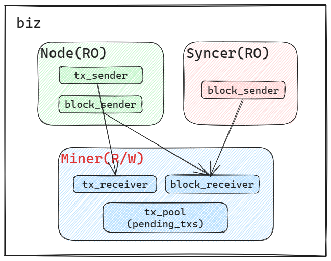

- [09 | 业务层：在业务层如何做读写分离？](#09--业务层在业务层如何做读写分离)
  - [1 架构](#1-架构)
  - [2 为什么要读写分离？](#2-为什么要读写分离)
    - [2.1 用户转账](#21-用户转账)
    - [2.2 将区块添加至数据库](#22-将区块添加至数据库)
  - [3 实现](#3-实现)
    - [3.1 Node](#31-node)
    - [3.2 Miner](#32-miner)
    - [3.3 Syncer](#33-syncer)
  - [4 小结](#4-小结)

# 09 | 业务层：在业务层如何做读写分离？

> 本文为实战课，需要切换到对应的代码分支，并配合依赖库的文档一起学习。
>
> - Repo: `https://github.com/jacob-chia/tinychain.git`
> - 分支：`git fetch && git switch 09-biz`
> - [crossbeam-channel](https://docs.rs/crossbeam-channel/latest/crossbeam_channel/): 比 std 更好用的 channel
>
> 其他 crates 使用简单，不再一一列举，清单在`Cargo.toml`中

我们在上节课识别出了 biz 层对外提供的接口，但除了这些接口，biz 层还需要两个后台任务：定时挖矿、定时从其他节点同步区块。总结一下，biz 层要实现三个核心模块：

- `Node`: 对外提供接口，处理来自网络（HTTP/P2P）的数据，
- `Miner`: 后台任务，定时挖矿；
- `Syncer`: 后台任务，定时从其他节点同步区块；

## 1 架构



biz 层采用了“读写分离”的架构，注意本文谈到的“读写分离”并非数据库层面的读写分离，而是业务层的架构，也就是说，`任何线程都可以“读”，但只有一个线程能“写”`。在本项目中，主要的写操作有两个：（1）将用户转账数据添加至交易池；（2）将区块添加至数据库。从上图来看，只有 Miner 线程有写权限，其他线程需要写操作时，将数据发送给 Miner 来写，包括：

- 当 Node 收到来自用户（或其他节点广播）的交易时，通过`tx_sender`发送给 Miner；
- 当 Node 收到来自其他节点广播的区块时，通过`block_sender`发送给 Miner；
- 当 Syncer 发现本地区块高度落后时，从其他节点同步区块，并通过`block_sener`发送给 Miner；

我们先解释一下这么做的好处再开始写代码。

## 2 为什么要读写分离？

### 2.1 用户转账

用户的转账交易会添加至“交易池”，后台 Miner 线程定期从交易池中取数据进行“挖矿”。从语义上来说，这个交易池是`用户多线程并发写，Miner单线程读`的。也就是说，需要在交易池上频繁的获取“写锁”，并且当我们后面写代码时就会发现为了校验一笔交易是否合法，我们需要锁住多个字段。

我们可以让`Miner单线程管理交易池`，用户并发的交易数据通过 channel 发送给 Miner，由 Miner 负责将交易添加至交易池，这样就避免了锁操作。

### 2.2 将区块添加至数据库

一个区块在添加至数据库（`add_block`）之前，要先校验区块是否合法（`check_block`），包括：区块挖矿难度、父区块 Hash，区块 Number。`为了减少数据库操作，应先 check_block，再 add_block`。但我们的业务中有多个线程需要执行`add_block`：

- Miner：本地生成的区块；
- Syncer：当本地区块高度落后时，从其他节点同步过来的区块；
- Node：来自其他节点广播的区块；

那么为了保证 `check_block` 和 `add_block` 的原子性，我们不得不把 `check_block` 放到 `add_block` 的**事务**中去执行。这么做不太好，因为：

- 检查时机有点儿晚了，应尽早发现不合格的数据；
- 不符合我们的分层理念，应尽量把业务逻辑放到业务层，保持存储层的简单。

我们可以让 Miner 线程负责 `add_block`，其他线程收到区块时，通过 channel 发送给 Miner 处理。这样 Miner 就可以在业务层 `check_block`，在存储层 `add_block`，而不用担心数据竞争的问题了。

## 3 实现

### 3.1 Node

Node 的职责是处理来自网络的请求，包括 HTTP 和 P2P，我们在上节课已识别出 Node 要实现的接口，实现非常简单，直接看源码吧：[src/biz/node.rs](../../src/biz/node.rs)。这里只有一点需要说明，我们看一下 Node 结构体的定义：

```rs
// src/biz/node.rs

#[derive(Debug, Clone)]
pub struct Node<S: State> {
    inner: Arc<NodeInner<S>>,
}

#[derive(Debug, Clone)]
pub struct NodeInner<S: State> {
    // A state machine that holds the state of the blockchain.
    state: S,
    // A channel to send a signed transaction to the miner.
    tx_sender: Sender<TxMsg>,
    // A channel to send a block to the miner.
    block_sender: Sender<Block>,

    // For facilitating a smooth demonstration, the node holds a wallet that stores all
    // the keys of the users, so that it can sign transactions on behalf of the users.
    // In the real world, every user should have their own wallet.
    wallet: Wallet,
}
```

NodeInner 是真正提供服务的结构体，但因为需要在多线程中共享引用，所以需要在外面包一层`Arc<>`，但这个“包一层`Arc<>`”的工作不应由使用者来做，而是自己要提供，所以我们又定义了一个`Node`来封装内部的复杂性，这是 Rust 代码的常见做法。

如果您觉得这么做多次一举，我可以举一个更复杂的例子。在 data 层我实现了一个`MemoryState`，用来调试 biz 的功能（将来会替换为 SledState），源码在[src/data/memory_state.rs](../../src/data/memory_state.rs)，对 biz 来说，MemoryState 是“开箱即用”的，不用关心内部实现，而其实 MemoryState 是这么定义的：

```rs
// src/data/memory_state.rs

#[derive(Debug, Clone)]
pub struct MemoryState {
    // 如果不封装这一层，那biz层不得不手动给InnerState加锁再加Arc了。
    inner: Arc<RwLock<InnerState>>,
}

#[derive(Debug, Clone)]
struct InnerState {
    blocks: BTreeMap<u64, Block>,
    balances: HashMap<String, u64>,
    account2nonce: HashMap<String, u64>,
}
```

### 3.2 Miner

Miner 的职责如下，知道了职责之后，源码看起来就轻松很多了，源码: [src/biz/miner.rs](../../src/biz/miner.rs)

- 当收到来自其他线程的交易时，将交易添加至交易池 `pending_txs`;
- 定期将`pending_txs`中的交易打包进区块，进行挖矿；
- 在挖矿过程中收到来自其他线程的区块时，取消本次挖矿，添加区块；

其中要说明的是检查交易是否合法的流程。先看相关的字段定义：

```rs
// src/biz/miner.rs

#[derive(Debug)]
pub struct Miner<S: State, P: PeerClient> {
    /// The pending transactions that are not yet included in a block.
    pending_txs: HashMap<Hash, SignedTx>,
    /// The pending state that is used to check if a transaction is valid.
    pending_state: PendingState,
    // The state of the blockchain.
    state: S,
    // ...
}

/// `PendingState` merges the current `state` and the `pending_txs`.
/// It is used to check if an incoming transaction is valid.
#[derive(Debug, Default)]
struct PendingState {
    // 用户余额
    balances: HashMap<String, u64>,
    // 用户Nonce，用户每发送一笔交易，Nonce就递增1
    account2nonce: HashMap<String, u64>,
}
```

假设场景如下：

- 数据库 `state` 中： `alice`: balance = 1000, nonce = 10; `bob`: balance = 0, nonce = 0;
- 交易池 `pending_txs` 中：有一笔交易`{from: alice, to: bob, value: 900, nonce: 10}`；这是一笔合法的交易；
- 现在又来了一笔交易`{from: alice, to: bob, value: 900, nonce: 10}`，如何检查这个 tx 是否合法？肯定要结合`state`和`pending_txs`两者的数据一起计算才行。

所以定义了一个字段 `pending_state`用来保存 state 和 pending_txs 合并后的余额和 Nonce。在上述场景中，pending_state 中的状态如下：`alice`: balance = 100, nonce = 11; `bob`: balance = 900, nonce = 0; 这样就能校验交易是否合法了。

另外需要注意，每次有新区快添加至数据库，都需要重置 pending_state，相关代码如下：

```rs
// src/biz/miner.rs

let result = self.state.add_block(block.clone());
if result.is_ok() {
    self.remove_mined_txs(&block);
    self.reset_pending_state();
}

fn reset_pending_state(&mut self) {
    // load from `state`
    self.pending_state.balances = self.state.get_balances();
    self.pending_state.account2nonce = self.state.get_account2nonce();

    // load from `pending_txs`
    for tx in self.get_sorted_txs() {
        self.update_pending_state(&tx);
    }
}
```

### 3.3 Syncer

Syncer 的逻辑非常简单，直接上源码： [src/biz/syncer.rs](../../src/biz/syncer.rs)

## 4 小结

在本课，我们通过实现 biz，解释了在业务层做读写分离的优势：既减少了锁的使用，又减轻了存储层的负担。

---

| [< 08-网络层](./08-network.md) | [10-存储层、功能演示 >](./10-data.md) |
| ------------------------------ | ------------------------------------- |
