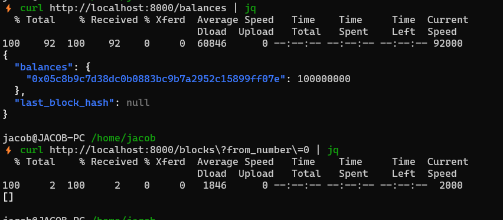
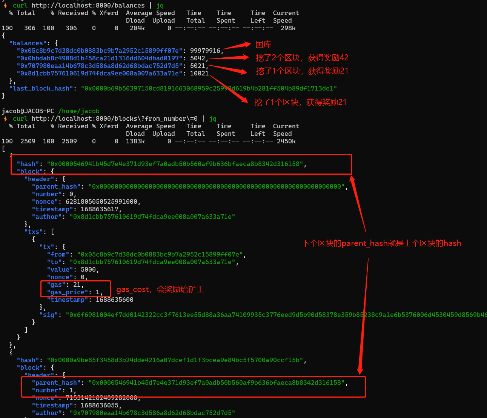

- [10 | 存储层与功能演示](#10--存储层与功能演示)
  - [1 Sled State](#1-sled-state)
  - [2 演示](#2-演示)
    - [2.1 创建演示账户](#21-创建演示账户)
    - [2.2 准备数据](#22-准备数据)
    - [2.3 启动三个节点](#23-启动三个节点)
    - [2.4 区块链初始状态](#24-区块链初始状态)
    - [2.5 用户转账](#25-用户转账)
    - [2.6 查询余额和区块](#26-查询余额和区块)
  - [3 小结](#3-小结)

# 10 | 存储层与功能演示

> 本文为实战课，需要切换到对应的代码分支，并配合依赖库的文档一起学习。
>
> - Repo: `https://github.com/jacob-chia/tinychain.git`
> - 分支：`git fetch && git switch 10-data`
> - [sled](https://docs.rs/sled/latest/sled/): 纯 Rust 编写的嵌入式 KV store， 对标 RocksDB
>
> 其他 crates 使用简单，不再一一列举，清单在`Cargo.toml`中

## 1 Sled State

我们在 biz 层已经定义好了 State trait，在存储层只需要基于 Sled 实现这些接口即可。直接看源码：[src/data/sled_state.rs](../../src/data/sled_state.rs)。需要注意的是，不管是 u64、String、还是结构体，在 sled 中都需要转为字节流存储。我们的结构体可以通过 protobuf 编码为字节流，但 u64 需要自己实现。代码如下：

```rs
// src/data/sled_state.rs

fn u64_decode(bytes: &[u8]) -> u64 {
    let mut buf = [0u8; 8];
    buf.copy_from_slice(bytes);
    // 注意使用的是大端序，这样才能正常64排序
    u64::from_be_bytes(buf)
}

fn u64_encode(n: u64) -> Vec<u8> {
    n.to_be_bytes().to_vec()
}
```

## 2 演示

### 2.1 创建演示账户

使用`RUST_LOG=INFO ./target/debug/tinychain new-account`创建 4 个账户，记下日志中显示的地址，您需要将下文中的所有地址替换为您新建的这 4 个地址：

- `Treasury`: "0x05c8b9c7d38dc0b0883bc9b7a2952c15899ff07e"
- `Alice`: "0x8d1cbb757610619d74fdca9ee008a007a633a71e"
- `Bob`: "0x707980eaa14b678c3d586a8d62d68bdac752d7d5"
- `Emma`: "0x0bbdab8c4908d1bf58ca21d1316dd604dbad0197"

### 2.2 准备数据

1. 修改根目录下的`genesis.json`，这是初始的账户余额，将文件中的国库地址替换为上面的 Treasury 的地址 `0x05c8b9c7d38dc0b0883bc9b7a2952c15899ff07e`；
2. 将根目录下的`db/` 复制两份：`db1/`、`db2/`；
3. 修改配置文件`doc/conf/*.toml`，修改矿工`author`的地址为上面的 Alice、Bob、Emma 的地址。

### 2.3 启动三个节点

在三个 terminal 中，进到项目根目录，分别执行下面的命令启动节点。

- Terminal 1，矿工 Alice: `RUST_LOG=INFO ./target/debug/tinychain run -c ./doc/conf/config-boot.toml`
- Terminal 2，矿工 Bob: `RUST_LOG=INFO ./target/debug/tinychain run -c ./doc/conf/config1.toml`
- Terminal 3，矿工 Emma: `RUST_LOG=INFO ./target/debug/tinychain run -c ./doc/conf/config2.toml`

观察日志，三个节点已互相知道彼此；并定期检查自己的区块高度是否落后于其他节点：

```log
INFO  tinychain::network::p2p  > 📣 Known peers ["12D3KooWNEG4GYu9pHdv9TcGAHvSgK82a5XsKdh9U96zxXRnFzL6", "12D3KooWSoC2ngFnfgSZcyJibKmZ2G58kbFcpmSPSSvDxeqkBLJc"]
INFO  tinychain::network::p2p  > 📣 >> [OUT] get_block_height from: 12D3KooWNEG4GYu9pHdv9TcGAHvSgK82a5XsKdh9U96zxXRnFzL6
INFO  tinychain::network::p2p  > 📣 << [IN] get_block_height response: Response { method: Height, body: Some(BlockHeightResp(BlockHeightResp { block_height: 0 })) }
INFO  tinychain::network::p2p  > 📣 >> [OUT] get_block_height from: 12D3KooWSoC2ngFnfgSZcyJibKmZ2G58kbFcpmSPSSvDxeqkBLJc
INFO  tinychain::network::p2p  > 📣 << [IN] get_block_height response: Response { method: Height, body: Some(BlockHeightResp(BlockHeightResp { block_height: 0 })) }
```

### 2.4 区块链初始状态

```sh
# 所有人的账户余额
curl http://localhost:8000/balances | jq
# 区块信息
curl http://localhost:8000/blocks?from_number=0 | jq
```

查询结果如下：



### 2.5 用户转账

1. 发送两笔一样的转账，查看日志

```sh
# 先查询Treasury的下一个nonce，每笔Tx的nonce要加一
curl -X GET http://localhost:8002/account/nonce?account=0x05c8b9c7d38dc0b0883bc9b7a2952c15899ff07e

# Treasury -> Alice: 5000
curl -X POST http://localhost:8002/transfer \
  -H 'Content-Type: application/json' \
  -d '{"from": "0x05c8b9c7d38dc0b0883bc9b7a2952c15899ff07e", "to": "0x8d1cbb757610619d74fdca9ee008a007a633a71e", "value": 5000, "nonce": 0}'

# Treasury -> Alice: 5000
curl -X POST http://localhost:8002/transfer \
  -H 'Content-Type: application/json' \
  -d '{"from": "0x05c8b9c7d38dc0b0883bc9b7a2952c15899ff07e", "to": "0x8d1cbb757610619d74fdca9ee008a007a633a71e", "value": 5000, "nonce": 0}'
```

从日志中可以看出，第一笔 tx 向其他节点广播了，第二笔 tx 失败，提示 Nonce 错误。

```log
INFO  tinychain::network::http > 📣 >> transfer: TxReq { from: "0x05c8b9c7d38dc0b0883bc9b7a2952c15899ff07e", to: "0x8d1cbb757610619d74fdca9ee008a007a633a71e", value: 5000, nonce: 0 }
INFO  tinychain::network::http > 📣 << transfer response: Ok(())
INFO  tinychain::network::p2p  > 📣 >> [OUT-BROADCAST] tx: SignedTx{ tx: Tx { from: "0x05c8b9c7d38dc0b0883bc9b7a2952c15899ff07e", to: "0x8d1cbb757610619d74fdca9ee008a007a633a71e", value: 5000, nonce: 0, gas: 21, gas_price: 1, timestamp: 1688635600 }, sig: 0x6f6981004ef7dd0142322cc3f7613ee55d88a36aa74109935c3776eed9d5b90d58378e359b85238c9a1e6b5376006d4530459d8569b464ce3c96cd881089321400 }
INFO  tinychain::network::http > 📣 >> transfer: TxReq { from: "0x05c8b9c7d38dc0b0883bc9b7a2952c15899ff07e", to: "0x8d1cbb757610619d74fdca9ee008a007a633a71e", value: 5000, nonce: 0 }
INFO  tinychain::network::http > 📣 << transfer response: Ok(())
ERROR tinychain::biz::miner    > ❌ Bad tx: InvalidTxNonce("0x05c8b9c7d38dc0b0883bc9b7a2952c15899ff07e", 1, 0)
```

继续观察三个节点的日志，其中一个节点挖出区块并向其他节点广播：

```log
INFO  tinychain::network::p2p  > 📣 >> [P2P-IN-BROADCAST] SignedTx{ tx: Tx { from: "0x05c8b9c7d38dc0b0883bc9b7a2952c15899ff07e", to: "0x8d1cbb757610619d74fdca9ee008a007a633a71e", value: 5000, nonce: 0, gas: 21, gas_price: 1, timestamp: 1688635600 }, sig: 0x6f6981004ef7dd0142322cc3f7613ee55d88a36aa74109935c3776eed9d5b90d58378e359b85238c9a1e6b5376006d4530459d8569b464ce3c96cd881089321400 }
INFO  tinychain::biz::miner    > 📣 Mining attempt: 0, elapsed: 92.122µs
INFO  tinychain::biz::miner    > 📣 Mined new Block '0x0000546941b45d7e4e371d93ef7a0adb50b560af9b636bfaeca8b8342d316158' 🎉🎉🎉:
INFO  tinychain::biz::miner    > 📣    Number: '0'
INFO  tinychain::biz::miner    > 📣    Nonce: '6281805050525990748'
INFO  tinychain::biz::miner    > 📣    Created: '1688635617'
INFO  tinychain::biz::miner    > 📣    Miner: '0x8d1cbb757610619d74fdca9ee008a007a633a71e'
INFO  tinychain::biz::miner    > 📣    Parent: '0x0000000000000000000000000000000000000000000000000000000000000000'
INFO  tinychain::biz::miner    > 📣    Attempt: '9670'
INFO  tinychain::biz::miner    > 📣    Time: 9.554963205s
INFO  tinychain::biz::miner    > 🎉🎉🎉🎉🎉🎉🎉🎉🎉🎉🎉🎉🎉🎉🎉🎉🎉🎉

INFO  tinychain::network::p2p  > 📣 >> [OUT-BROADCAST] block: Block { header: BlockHeader { number: 0, parent_hash: 0x0000000000000000000000000000000000000000000000000000000000000000, nonce: 6281805050525990748, timestamp: 1688635617, author: "0x8d1cbb757610619d74fdca9ee008a007a633a71e" }, txs: [SignedTx{ tx: Tx { from: "0x05c8b9c7d38dc0b0883bc9b7a2952c15899ff07e", to: "0x8d1cbb757610619d74fdca9ee008a007a633a71e", value: 5000, nonce: 0, gas: 21, gas_price: 1, timestamp: 1688635600 }, sig: 0x6f6981004ef7dd0142322cc3f7613ee55d88a36aa74109935c3776eed9d5b90d58378e359b85238c9a1e6b5376006d4530459d8569b464ce3c96cd881089321400 }] }
```

其他节点收到区块并取消挖矿：

```log
INFO  tinychain::network::p2p  > 📣 >> [P2P-IN-BROADCAST] Block { header: BlockHeader { number: 0, parent_hash: 0x0000000000000000000000000000000000000000000000000000000000000000, nonce: 6281805050525990748, timestamp: 1688635617, author: "0x8d1cbb757610619d74fdca9ee008a007a633a71e" }, txs: [SignedTx{ tx: Tx { from: "0x05c8b9c7d38dc0b0883bc9b7a2952c15899ff07e", to: "0x8d1cbb757610619d74fdca9ee008a007a633a71e", value: 5000, nonce: 0, gas: 21, gas_price: 1, timestamp: 1688635600 }, sig: 0x6f6981004ef7dd0142322cc3f7613ee55d88a36aa74109935c3776eed9d5b90d58378e359b85238c9a1e6b5376006d4530459d8569b464ce3c96cd881089321400 }] }
INFO  tinychain::biz::miner    > 📣 Received a block from other peers, cancel mining.
```

2. 再发送几笔交易

```sh
# 先查询Treasury的下一个nonce，每笔Tx的nonce要加一
curl -X GET http://localhost:8002/account/nonce?account=0x05c8b9c7d38dc0b0883bc9b7a2952c15899ff07e

# Treasury -> Alice: 5000
curl -X POST http://localhost:8002/transfer \
  -H 'Content-Type: application/json' \
  -d '{"from": "0x05c8b9c7d38dc0b0883bc9b7a2952c15899ff07e", "to": "0x8d1cbb757610619d74fdca9ee008a007a633a71e", "value": 5000, "nonce": 1}'

# Treasury -> Bob: 5000
curl -X POST http://localhost:8002/transfer \
  -H 'Content-Type: application/json' \
  -d '{"from": "0x05c8b9c7d38dc0b0883bc9b7a2952c15899ff07e", "to": "0x707980eaa14b678c3d586a8d62d68bdac752d7d5", "value": 5000, "nonce": 2}'

# Treasury -> Emma: 5000
curl -X POST http://localhost:8002/transfer \
  -H 'Content-Type: application/json' \
  -d '{"from": "0x05c8b9c7d38dc0b0883bc9b7a2952c15899ff07e", "to": "0x0bbdab8c4908d1bf58ca21d1316dd604dbad0197", "value": 5000, "nonce": 3}'
```

### 2.6 查询余额和区块

```sh
# 所有人的账户余额
curl http://localhost:8000/balances | jq
# 区块信息
curl http://localhost:8000/blocks?from_number=0 | jq
```

查询结果如下：



## 3 小结

```sh
⚡ tokei .
===============================================================================
 Language            Files        Lines         Code     Comments       Blanks
===============================================================================
 JSON                    1            6            6            0            0
 Protocol Buffers        1           70           54            3           13
 TOML                    7          246          153           61           32
-------------------------------------------------------------------------------
 Markdown               11         2636            0         1965          671
 |- TOML                 1           13            6            2            5
 (Total)                           2649            6         1967          676
-------------------------------------------------------------------------------
 Rust                   36         3672         2999           85          588
 |- Markdown            27          178            0          165           13
 (Total)                           3850         2999          250          601
===============================================================================
 Total                  56         6630         3212         2114         1304
===============================================================================
```

我们用十节课的时间，从 0 开始构造一个具备转账功能的区块链，共写了 6000 多行代码（包括注释）和文档。并且，我们通过 tinychain 学会了：

- 基于分层的架构设计
- 基于 CSP 的无锁并发模型
- 如何在业务层通过读写分离减少锁的使用
- 大量的 Rust 实战技巧

恭喜！🎉🎉🎉

---

| [< 09-业务层：在业务层如何做读写分离？](./09-biz.md) | [目录 >](../../README_ZH.md) |
| ---------------------------------------------------- | ---------------------------- |
